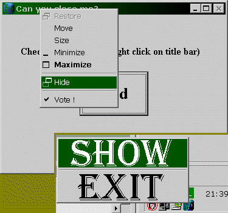



## Tricks with menu \- UPDATED

### Description

This code shows how to use many API functions in "menu" category (see the screen shot!). Viewing this code you can learn how to disable close (x) button on title bar, how to edit system menu (minimize, maximize, close, etc.) of specified window, how to remove items from menu, add small bitmaps next to the text in menu items, get handle to system menu, menu of window and submenu, add as big bitmap as you want to menu item, hide menu on command and count menu items. It also shows how to use window procedure (called by AddressOf), how to hide your application and add icon to taskbar status area and how to open internet pages without using any controls. UPDATED: now you can add to menu also icons!
 
### More Info
 

             |
---                |---
**Submitted On**   |2003-08-29 01:40:10
**By**             |[Filip Wielewski](https://github.com/Planet-Source-Code/PSCIndex/blob/master/ByAuthor/filip-wielewski.md)
**Level**          |Intermediate
**User Rating**    |3.8 (23 globes from 6 users)
**Compatibility**  |VB 6\.0
**Category**       |[Windows API Call/ Explanation](https://github.com/Planet-Source-Code/PSCIndex/blob/master/ByCategory/windows-api-call-explanation__1-39.md)
**World**          |[Visual Basic](https://github.com/Planet-Source-Code/PSCIndex/blob/master/ByWorld/visual-basic.md)
**Archive File**   |[Tricks\_wit1637578302003\.zip](https://github.com/Planet-Source-Code/filip-wielewski-tricks-with-menu-updated__1-48058/archive/master.zip)

